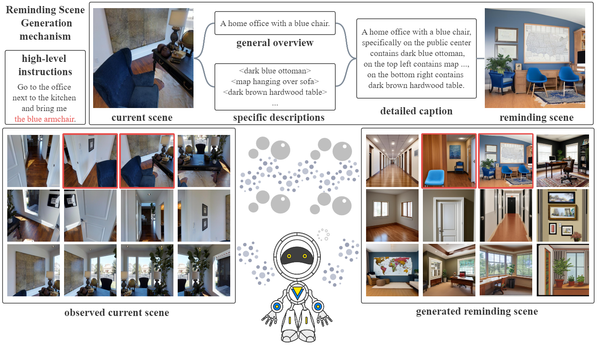

## Overview
This repository is the implementation for the paper "VISIONARY: Vision-aware enhancement with reminding scenes generated by captions via multimodal transformer for embodied referring expression".

Authors: Zhengwu Yuan, Peixian Tang, Xinguang Sang, Fan Zhang, Zheqi Zhang


## Requirements
1. Please follow the baseline work [DUET](https://github.com/cshizhe/VLN-DUET) and [LAD](https://github.com/zehao-wang/LAD) to complete the environment preparation and download of related data.

2. Download the additional generated content for VISIONARY from [here](https://drive.google.com/drive/folders/15aPIDUTwWqhRqX5Zp-doJg0j6-pwjavs?usp=drive_link), and put the data in `datasets` directory.

## Training
After configuring the training strategy, run the following script to train:
```
cd training_src
sh scripts/final_frt_gd_finetuning_stable.sh
```

## Evaluation
Replace `resumedir` in `eval.sh` and run this script to evaluate the model. Furthermore, the result file could be submitted to the online [leaderboard](https://eval.ai/web/challenges/challenge-page/606/leaderboard/1683) to get the test performance.
```
cd training_src
sh scripts/eval.sh
```
P.S. The final checkpoints of VISIONARY model can be found [here](https://drive.google.com/drive/folders/105X4u6JS6XQ8tR1FuExWp7y6BiaG3D1q?usp=drive_link).

## Acknowledgement
The code is mainly based on [LAD](https://github.com/zehao-wang/LAD), [DUET](https://github.com/cshizhe/VLN-DUET), and this work is inspired by [PanoGen](https://github.com/jialuli-luka/PanoGen), [KERM](https://github.com/xiangyangli-cn/KERM). Thanks for their awesome works!
